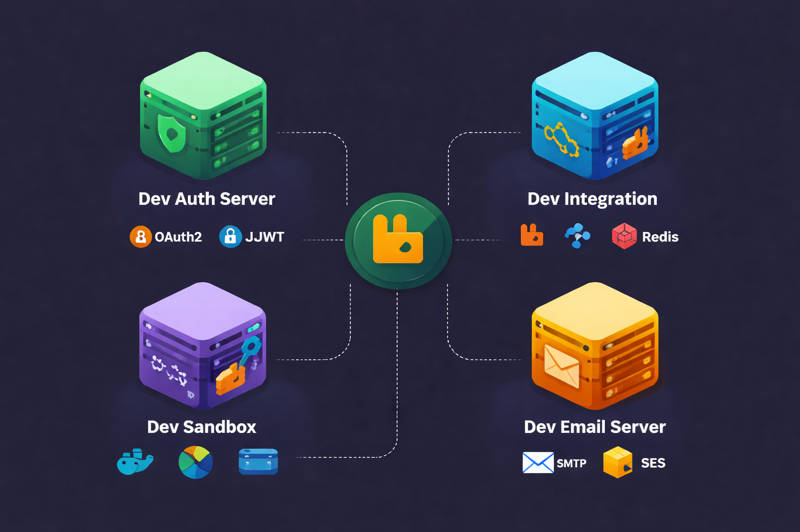
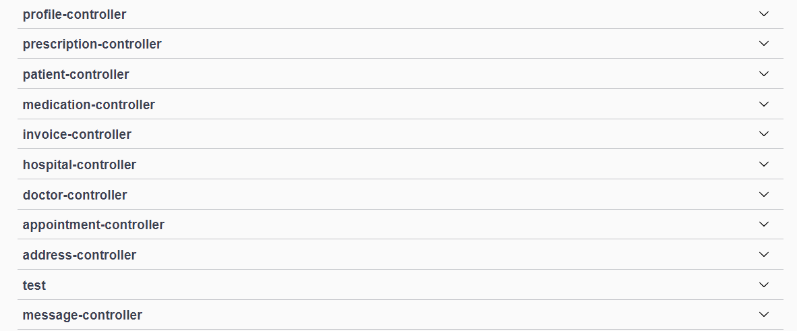
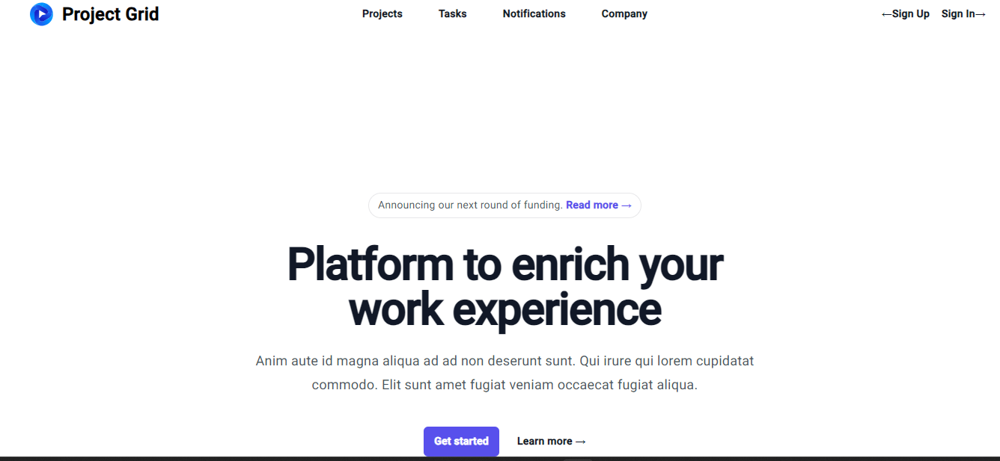
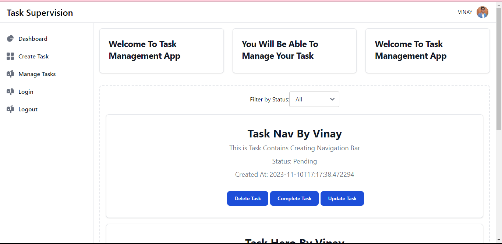
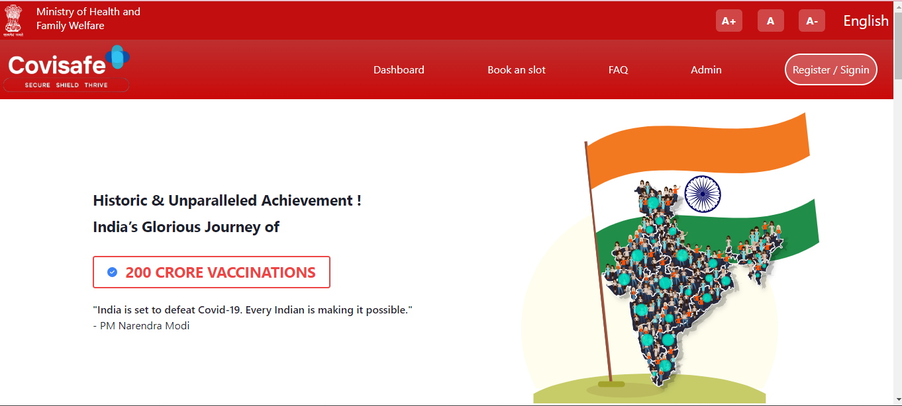

# Hi, I'm Vinay Kr. Singh 👋
**Java Backend Developer | Microservices & Enterprise Applications**

[Resume](./assets/Vinay_Singh_Java_Backend_Developer.pdf) | [LinkedIn](https://www.linkedin.com/in/vinay-kumar-singh-849357253/) | [GitHub](https://github.com/Guyvinay)

---

## 👨‍💻 About Me
I'm a Java Backend Developer passionate about building **scalable, secure, and high-performance enterprise systems**.  
I specialize in **Spring Boot microservices**, API design (REST, GraphQL, gRPC), messaging systems (RabbitMQ, WebSocket), and distributed system architecture.  

I thrive in collaborative environments and enjoy tackling complex backend challenges such as **bulk data pipelines, production debugging, and performance optimization**.  

Explore my projects below to see my work in action.

---

## 💻 Tech Stack

**Backend & Frameworks:**  
Java, Spring Boot, Spring Security (JWT, OAuth2, SAML), Microservices, Hibernate/Envers, Liquibase, JPA, Spring AOP, Multitenancy, Python, Flask  

**APIs & Messaging:**  
REST, GraphQL, gRPC, RabbitMQ, WebSocket  

**Databases & Storage:**  
PostgreSQL, MySQL, Elasticsearch, Redis  

**Frontend (for full-stack projects):**  
Angular, TypeScript  

**DevOps & CI/CD:**  
Docker, Jenkins, Nexus, Kubernetes, OpenShift, Git, Bitbucket, Maven, Grafana, New Relic  

**Development Tools:**  
IntelliJ IDEA, VSCode, STS, Postman, Mockoon, GitHub  

---

## 🏆 Experience Highlights

- Built **enterprise-grade microservices platform** with authentication, multitenancy, asynchronous messaging, and bulk data pipelines processing 1M+ records.  
- Developed **Dev Email Server** with idempotent asynchronous email delivery and Redis caching.  
- Debugged production login issues and improved bulk onboarding performance from timeout to successful batch invites.  
- Engineered dashboards, data quality metrics, and analytics widgets for enterprise records, reducing manual reporting time by 30% and improving data accuracy by 15%.  
- Upgraded Angular projects from v16 → v19, improving load times by 25% and reducing deprecated warnings by 90%.  

---

## 🛠 Projects

### Enterprise Microservices Platform

- Microservices: `dev-auth-server`, `dev-integration`, `dev-sandbox`, `dev-email-server`  
- Features: Authentication & Authorization (JWT/OAuth/SAML), RabbitMQ messaging, gRPC, REST/GraphQL APIs, Elasticsearch indexing, Redis caching  
- Highlights: High-volume pipelines (>1M records), multi-tenant support, idempotent email delivery, production debugging  
- [GitHub](https://github.com/Guyvinay) | Architecture: Backend service diagram

### We Care

- Comprehensive application to automate hospital operations.  
- [GitHub](https://github.com/Guyvinay/WeCare) | [Live Demo](https://github.com/Guyvinay/WeCare)

### Project Grid

- Project management tool to track tasks, timelines, and progress efficiently.  
- [GitHub](https://github.com/Guyvinay/Project-Grid) | [Live Demo](https://project-grid.vercel.app)

### Task Supervision

- Angular + Spring Boot application to manage individual tasks and workflows.  
- [GitHub](https://github.com/Guyvinay/Coding-Assignment/tree/main/Task-Supervision-App) | [Live Demo](https://coding-assignment-sand.vercel.app/)

### Covisafe+

- Real-time pandemic tracking, vaccination booking, and risk assessment.  
- [GitHub](https://github.com/Guyvinay/covisafePlus) | [Live Demo](https://covisafe-plus.vercel.app/)

---

## 📫 Contact Me

- Email: [mrsinghvinay563@gmail.com](mailto:mrsinghvinay563@gmail.com)  
- Phone: +91 7479856872  
- LinkedIn: [Vinay Kr. Singh](https://www.linkedin.com/in/vinay-kumar-singh-849357253/)  
- GitHub: [Guyvinay](https://github.com/Guyvinay)  
- Twitter: [@MR_SINGH_VINAY](https://twitter.com/MR_SINGH_VINAY)  

---

> Made with ❤️ by Vinay Kr. Singh
